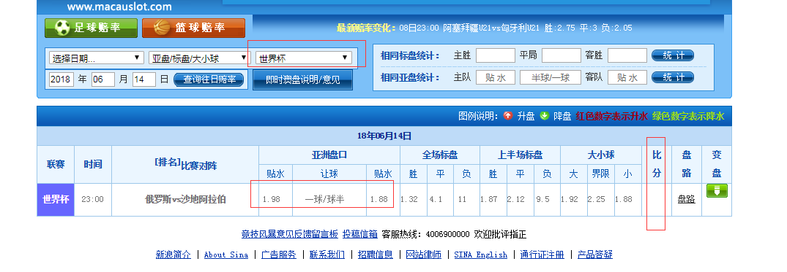
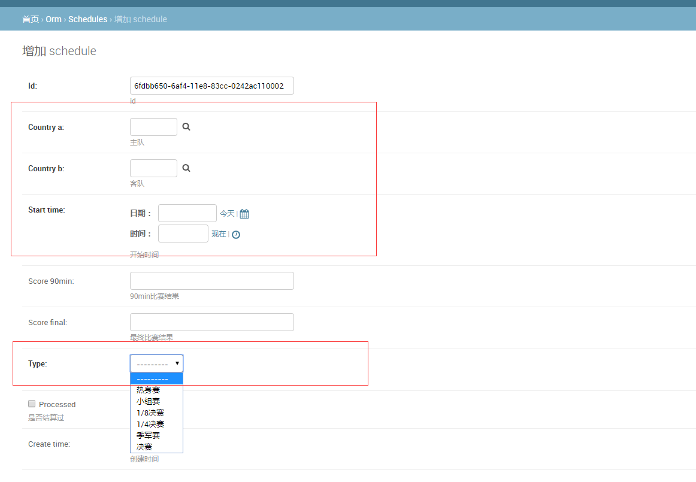
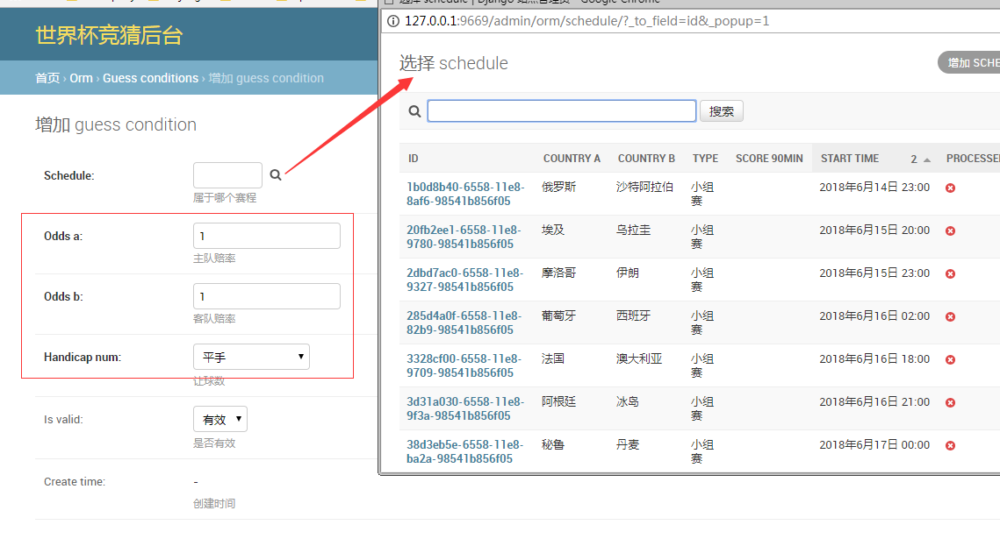
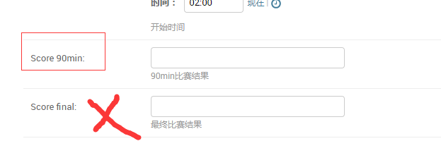

# 关于世界杯竞猜的一个项目

## 技术概述

* 前台是由公司的前端人员楠姐用Vue写的两个界面
* 后台是由django restframe work框架写的
* 部署采用uwsgi + nginx，前台代码打包到template目录，nginx配置文件直接将template目录配一个与后台不重复的url

## 地址详情

* 访问域名地址：

  ../

* ip端口地址：

    ../

* django admin登陆后台地址：

    ../admin/

## 录入赛程的操作步骤

1. 登陆django admin后台，账号找super super管理员注册。
2. 打开“澳盘”界面 http://odds.sports.sina.com.cn/odds/index.php。 选择对应比赛类型**世界杯**+**比赛日时间**，搜索对应的赛程。如下：
    
3. 在admin后台录入赛程，对应的是`schedule` model。录入以下截图中标红线的字段，其中国家a是澳盘中左边球队，国家b是右边的球队。`start_time`不一定以澳盘提供的时间为准，录之前先去网上查一下，只要不比正常时间靠后即可。
    

## 录入比赛条件的操作步骤

1. 同上
2. 同上
3. 对应的是`guess conditions`model。录入的时候以上面的澳盘截图中的，贴水对应`odds_a`和`odds_b`，顺序同上。
    

## 次日录入比赛结果的操作步骤

1. 同上
2. 同上
3. 直接将澳盘界面后面的比分录入到`score_90min`字段，比分都是90min的结果，如果与最终比分不一致不比惊讶。
    

## 其它
* 结算都是后台定时任务实现的，只要录入比赛结果，会触发任务结算。
